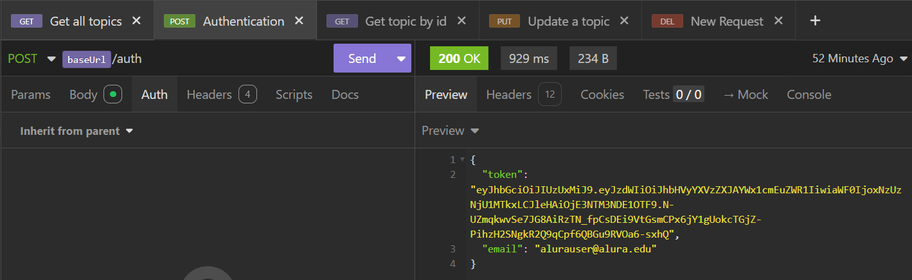
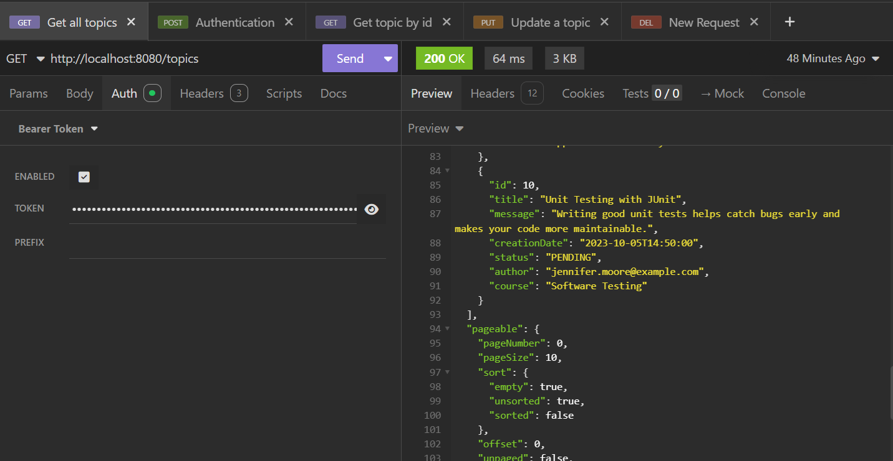
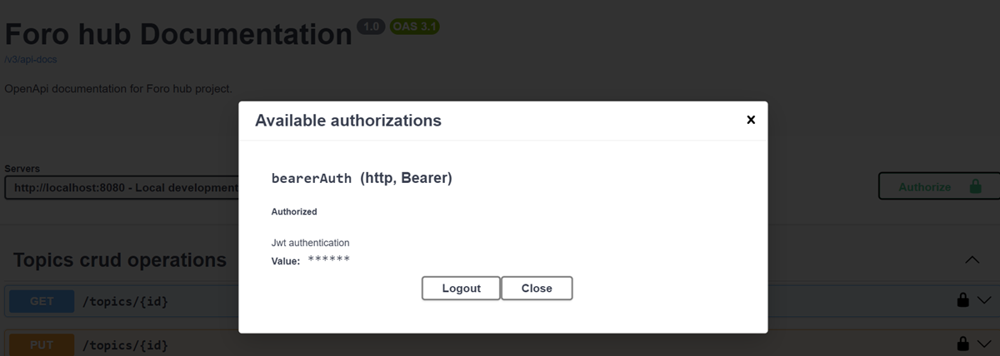

# 📌 Foro Hub

Um fórum de discussão desenvolvido como desafio do programa Oracle Next Education (ONE)

## 📋 Descrição
Projeto backend de um fórum desenvolvido em Spring Boot, com:
- CRUD completo de tópicos
- Validações customizadas
- Arquitetura em camadas (Controller → Service → Repository)
- Base de dados MySQL

## ⚙️ Funcionalidades
#### ✅ CRUD Completo
- Criação, leitura, atualização e remoção de tópicos

#### ✅ Validações
- Campos obrigatórios
- Títulos e mensagens únicas
- Formato de dados validado

#### ✅ Paginación
- Listagem de tópicos com paginação (Spring Pageable)

#### ✅ Arquitetura Limpa
- DTOs para requests/responses
- Tratamento de erros global

#### 🔐 Sistema de Autenticação
- O projeto inclui **Spring Security + JWT** para gestão segura de utilizadores.

#### Endpoints de Autenticação
| Método | Rota   | Descrição                          |
|--------|--------|-----------------------------------|
| POST   | `/auth` | Autentica o utilizador e retorna JWT |

#### 📊 Documentação com Swagger UI
- O projeto inclui documentação automática via **Swagger** com suporte a autenticação JWT.

## 📸 Screenshots
*Sistema de Autenticação*



*Listagem de tópicos com paginação (Spring Pageable)*



*Documentação via **Swagger***


*Autenticação com Swagger*

## 🛠️ Tecnologias

- **Java 21** 
- **Spring Boot**
- **Spring Data JPA** 
- **Hibernate** 
- **MySQL** 
- **Lombok** 

## 🚀 Como executar

### Pré-requisitos
- Java 21+
- MySQL instalado
- IDE (IntelliJ, Eclipse, etc.)

### Pasos
1. Clonar o repositório:
    ```bash
    git clone https://github.com/luisasmatortega/foro-hub.git
    cd foro-hub
    ```

2. Configurar a base de dados:
    - Criar uma base de dados MySQL chamada foro_hub
    - Ajustar as credenciais no application.properties:
    ```bash
    spring.datasource.url=jdbc:mysql://localhost:3306/foro_hub  
    spring.datasource.username=seu_user  
    spring.datasource.password=sua_password
    ```
3. Executar a aplicação:
    ```bash
    ./mvnw spring-boot:run  
    ```
